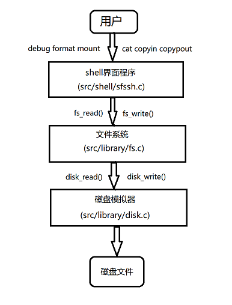
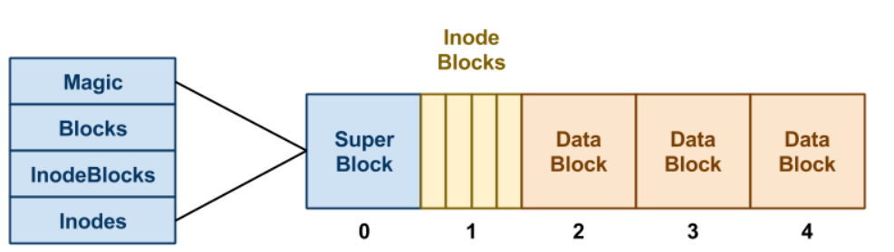
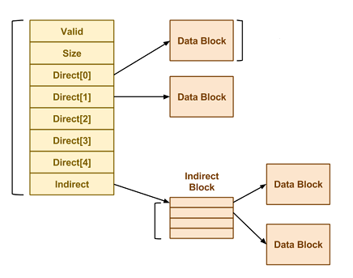
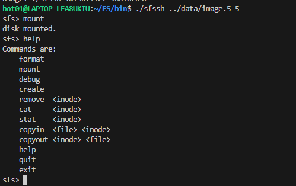
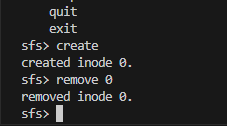

### 文件系统流程图



在此程序中有三个模块

1.  **Shell: **第一个模块是一个简单的 shell 程序，允许用户在shell界面上执行操作，例如打印有关文件系统的调试信息、格式化新文件系统、挂载文件系统、创建文件以及将数据复制入或复制出文件系统的。它会将这些用户命令转换为**文件系统**操作，例如`fs_debug`、`fs_format`、`fs_create`、 `fs_remove`、`fs_stat`、`fs_read`和`fs_write`。
2.  **文件系统：**第二个组件通过shell获取用户指定的操作，并在磁盘上执行这些操作。该组件负责组织磁盘上的数据结构并执行所有必要的读写使得数据可以长久存储。为了存储数据，它需要通过`isk_read` 和`disk_write`等函数与**磁盘模拟器**交互，这些函数允许文件系统以字节块的形式读取和写入磁盘。
3.  **磁盘模拟器：**第三个组件通过将普通文件（称为**磁盘映像文件**）划分为`64 MB`块来模拟磁盘，并且仅允许**文件系统**以块为单位进行读写。该模拟器将使用正常的`open`、`read`和`write`系统调用将数据存储到磁盘映像中。


### 文件系统架构图




在上图中，我们有一个以超级块开头的磁盘映像。这个超级块由四个字段组成：

1.  **Magic:** 第一个字段始终是MAGIC_NUMBER。格式化程序将这个数字放入超级块的最前面，作为一种文件系统的“签名”。当文件系统被挂载时，操作系统会查找这个魔术数字。如果它正确，那么就假定磁盘包含一个有效的文件系统。如果存在其他数字，挂载失败，可能是因为磁盘未经格式化或包含其他类型的数据。
2.  **Blocks:** 第二个字段是块的总数，与磁盘上的块数相同。
3.  **InodeBlocks:**  第三个字段是用于存储inode的块数。格式化程序负责计算这个值。
4.  **Inodes:**  第四个字段是这些inode块中的总inode数目。


### Inode架构图



inode的每个字段都是一个4字节（32位）整数。

Valid字段如果inode有效（即已创建），则为1，否则为0。

Size字段包含inode数据的逻辑大小（以字节为单位）。

有5个直接指向数据块的指针，以及一个指向间接数据块的指针。在这里，"指针"只是表示可以找到数据的块号。值为0可以用来表示一个空块指针

### 核心数据结构

#### 磁盘模拟器

```c
/* 磁盘结构 */

typedef struct Disk Disk;

struct Disk {
    int	    fd;	        /* 磁盘映像的文件描述符 */
    size_t  blocks;     /* 磁盘映像中的块数 */
    size_t  reads;      /* 从磁盘映像中读取的次数	*/
    size_t  writes;     /*  写入磁盘映像的次数	*/
}; 

/* 磁盘函数 */

Disk *	disk_open(const char *path, size_t blocks);
void	disk_close(Disk *disk);

ssize_t	disk_read(Disk *disk, size_t block, char *data);
ssize_t	disk_write(Disk *disk, size_t block, char *data);

```

#### 文件系统

```c
/* 文件系统结构 */

typedef struct SuperBlock SuperBlock;
struct SuperBlock {
    uint32_t    magic_number;                   /* 文件系统魔数 */
    uint32_t    blocks;                         /* 文件系统中的块数 */
    uint32_t    inode_blocks;                   /* 用于存储inode的保留块数 */
    uint32_t    inodes;                         /* 文件系统中的inode的个数 */
};

typedef struct Inode      Inode;
struct Inode {
    uint32_t    valid;                          /* inode是否有效 */
    uint32_t    size;                           /* 文件大小 */
    uint32_t    direct[POINTERS_PER_INODE];     /* 直接指针 */
    uint32_t    indirect;                       /* 间接指针 */
};

typedef union  Block      Block;
union Block {
    SuperBlock  super;                          /* 将块视为超级块 */
    Inode       inodes[INODES_PER_BLOCK];       /* 将块视为inode表 */
    uint32_t    pointers[POINTERS_PER_BLOCK];   /* 将块视为指针 */
    char        data[BLOCK_SIZE];               /* 将块视为数据 */
};

typedef struct FileSystem FileSystem;
struct FileSystem {
    Disk        *disk;                          /* 挂载文件系统的磁盘 */
    bool        *free_blocks;                   /* 空闲块位图  */
    SuperBlock   meta_data;                     /* 文件系统元数据 */
};

/* 文件系统函数 */

void    fs_debug(Disk *disk);
bool    fs_format(FileSystem *fs, Disk *disk);

bool    fs_mount(FileSystem *fs, Disk *disk);
void    fs_unmount(FileSystem *fs);

ssize_t fs_create(FileSystem *fs);
bool    fs_remove(FileSystem *fs, size_t inode_number);
ssize_t fs_stat(FileSystem *fs, size_t inode_number);

ssize_t fs_read(FileSystem *fs, size_t inode_number, char *data, size_t length, size_t offset);
ssize_t fs_write(FileSystem *fs, size_t inode_number, char *data, size_t length, size_t offset);
```

### 运行时截图



